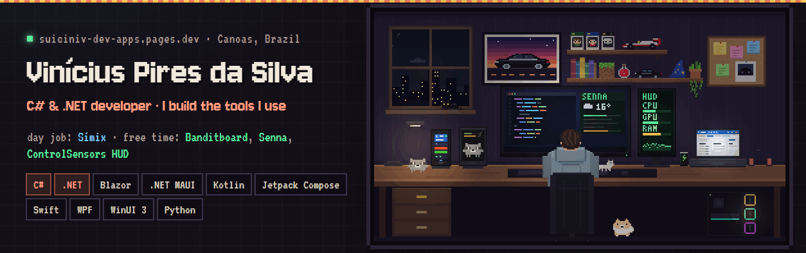
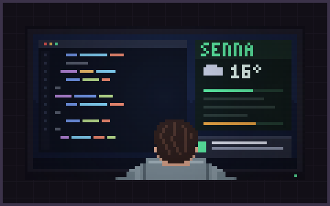
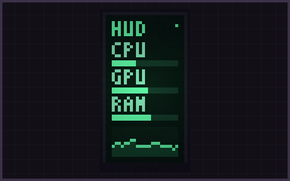
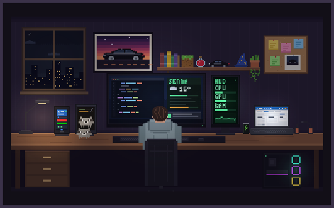

  
  
  
  

## Hi, I'm Vini 👋

I'm a C# and .NET developer from Canoas, Brazil. At **Símix** I work on time tracking software, from the database to the UI: a multitenant SaaS built with ABP Framework, Blazor, PostgreSQL and Azure, and a .NET MAUI app on Google Play and the App Store. I joined in 2020 as a support intern, setting up time clocks, and got here self-taught, straight from the docs.

In my free time I build the tools I use myself. Some ideas are useful. Others… I just wanted to see them working.

## 🦝 Banditboard

Keep an eye on your Claude Code and Antigravity limits on an old Android phone, an iPhone or an Apple Watch, or in a small widget on Windows and Mac. Every model is Racco, a pixel art raccoon that sleeps, sweats and bursts as the limit gets close.

  
  
  
  

Kotlin with Jetpack Compose and Compose Desktop, Swift on Apple devices. Usage comes from Claude Code itself through a hook, with no token on the phone, and the pairing key is encrypted with AES-256-GCM. **[Website](https://banditboard.pages.dev/)** · **[Code](https://github.com/suiciniv-dev/banditboard)**

## 🧰 Also on my desk

<table>
  <tr>
    <td width="33%" valign="top">
      
      <h3>Senna</h3>
      My Windows assistant. v1 talked: Python, speech recognition and LLMs. v2 works quietly: C# and WinUI 3, a daily panel, Windows notifications and a memory Claude Code reads between sessions.
        Private · built for one machine, mine.
    </td>
    <td width="33%" valign="top">
      
      <h3>ControlSensors HUD</h3>
      A real-time hardware HUD for a side monitor: CPU, GPU, memory, storage, weather and audio, with media and gaming modes. C# and WPF.
        <a href="https://github.com/suiciniv-dev/ControlSensors">Code</a> · <a href="https://github.com/suiciniv-dev/ControlSensors/releases/latest">Download</a>
    </td>
    <td width="33%" valign="top">
      
      <h3>suiciniv.dev</h3>
      My portfolio: this desk as a website. Power on the setup and click everything; there are 16 secrets hidden in it.
        <a href="https://suiciniv-dev-apps.pages.dev/">Visit</a> · <a href="https://github.com/suiciniv-dev/portfolio-apps">Code</a>
    </td>
  </tr>
</table>

## 🧪 Stack

**Day to day** 
           

**Free time** 
        

## 🧙 The mage's path

<code>Apprentice</code> → <code>Initiate</code> → <code>Adept</code> → <code>Mage</code> → <b><code>Arcanist III</code></b> → 🔒 <code>Archmage</code>

support intern · QA · deployment · junior developer · mid-level I, II and III · the next step

 

<picture>
  <source media="(prefers-color-scheme: dark)" srcset="https://raw.githubusercontent.com/suiciniv-dev/suiciniv-dev/output/snake-dark.svg">
  
</picture>

🇧🇷 Em português

 

Sou desenvolvedor C# e .NET, de Canoas (RS), Pleno III na **Símix**. Trabalho do banco de dados à interface num SaaS multitenant de gestão de ponto (ABP Framework, Blazor, PostgreSQL e Azure) e no app em .NET MAUI que está na Google Play e na App Store. Entrei em 2020 como estagiário de suporte, configurando relógio de ponto, e cheguei aqui aprendendo sozinho, direto da documentação.

No meu tempo livre, construo as ferramentas que eu mesmo uso:

- **[Banditboard](https://banditboard.pages.dev/)**: os limites do Claude Code e do Antigravity num celular Android parado na mesa, no iPhone, no Apple Watch ou num widget no Windows e no Mac, com o Racco, um guaxinim em pixel art.
- **Senna**: o assistente do meu Windows. A v1 falava; a v2, em C# e WinUI 3, trabalha calada.
- **[ControlSensors HUD](https://github.com/suiciniv-dev/ControlSensors)**: um HUD de sensores para o monitor do lado.
- **[suiciniv.dev](https://suiciniv-dev-apps.pages.dev/)**: o meu portfólio, esta mesa como site.

🥚 Psst: on my portfolio, try typing <code>hesoyam</code>.

